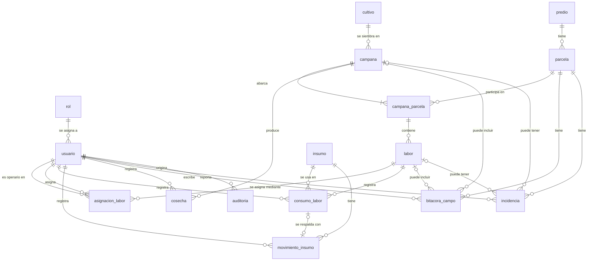

# DER lógico v0.1 — AgroControl

Base: `model-relational-v0.1.md` (Clase 03) y ficha oficial del proyecto 16. Este documento todavía no contiene SQL ni tipos de datos.

Respecto a la Clase 03 se agregan las cuatro tablas que habían quedado pendientes: `movimiento_insumo`, `bitacora_campo`, `incidencia` y `auditoria`. Con ellas el DER cubre los 15 conceptos de la sección F de la ficha. Además incluye la tabla puente `campana_parcela`, 16 tablas en total.

Cambio respecto a la primera versión: el equipo confirmó que una campaña abarca varias parcelas. Se agrega la tabla puente `campana_parcela`; `campana` ya no tiene `parcela_id` y `labor` apunta a `campana_parcela`.

## Convenciones
- PK = clave primaria
- FK = clave foránea
- UQ = unicidad
- NN = obligatorio
- NULL = opcional (puede faltar legítimamente)
- CK = regla de dominio o restricción simple
- Nombres en español, singular y snake_case. PK técnica `<tabla>_id` en todas las tablas.

## Diagrama

## rol
- PK rol_id
- NN nombre
- NULL descripcion
- UQ nombre

## usuario
- PK usuario_id
- FK rol_id -> rol.rol_id (NN)
- NN nombre_completo
- NN correo
- NN activo
- UQ correo

## predio
- PK predio_id
- NN nombre
- NULL ubicacion
- NULL descripcion
- UQ nombre

## parcela
- PK parcela_id
- FK predio_id -> predio.predio_id (NN)
- NN codigo
- NN nombre
- NN superficie
- NN unidad_superficie
- NULL ubicacion_referencial
- UQ (predio_id, codigo)
- CK superficie > 0

## cultivo
- PK cultivo_id
- NN nombre
- NULL variedad
- NULL descripcion
- UQ (nombre, variedad)

## campana
- PK campana_id
- FK cultivo_id -> cultivo.cultivo_id (NN)
- NN nombre
- NN fecha_inicio
- NN fecha_fin_prevista
- NULL fecha_cierre
- NN estado
- CK estado en {activa, finalizada}
- CK fecha_inicio <= fecha_fin_prevista
- CK si estado = finalizada, fecha_cierre es obligatoria

## campana_parcela
- PK campana_parcela_id
- FK campana_id -> campana.campana_id (NN)
- FK parcela_id -> parcela.parcela_id (NN)
- UQ (campana_id, parcela_id)

## labor
- PK labor_id
- FK campana_parcela_id -> campana_parcela.campana_parcela_id (NN)
- NN tipo_labor
- NULL descripcion
- NN fecha_programada
- NULL fecha_inicio_real
- NULL fecha_fin_real
- NN estado
- CK estado en {planificada, asignada, en_ejecucion, completada, cancelada}
- CK fecha_inicio_real <= fecha_fin_real

## asignacion_labor
- PK asignacion_labor_id
- FK labor_id -> labor.labor_id (NN)
- FK operario_id -> usuario.usuario_id (NN)
- FK asignado_por_id -> usuario.usuario_id (NN)
- NN fecha_asignacion
- UQ (labor_id, operario_id)

## insumo
- PK insumo_id
- NN codigo
- NN nombre
- NULL categoria
- NN unidad_medida
- NN stock_disponible
- UQ codigo
- CK stock_disponible >= 0

## movimiento_insumo
- PK movimiento_insumo_id
- FK insumo_id -> insumo.insumo_id (NN)
- FK registrado_por_id -> usuario.usuario_id (NN)
- FK consumo_labor_id -> consumo_labor.consumo_labor_id (NULL)
- NN tipo
- NN cantidad
- NN fecha_movimiento
- NULL motivo
- UQ consumo_labor_id
- CK tipo en {entrada, salida}
- CK cantidad > 0
- CK consumo_labor_id sólo puede tener valor si tipo = salida

## consumo_labor
- PK consumo_labor_id
- FK labor_id -> labor.labor_id (NN)
- FK insumo_id -> insumo.insumo_id (NN)
- FK registrado_por_id -> usuario.usuario_id (NN)
- NN cantidad
- NN fecha_consumo
- CK cantidad > 0

## bitacora_campo
- PK bitacora_campo_id
- FK parcela_id -> parcela.parcela_id (NN)
- FK campana_id -> campana.campana_id (NULL)
- FK labor_id -> labor.labor_id (NULL)
- FK autor_id -> usuario.usuario_id (NN)
- NN fecha_registro
- NN descripcion

## incidencia
- PK incidencia_id
- FK parcela_id -> parcela.parcela_id (NN)
- FK campana_id -> campana.campana_id (NULL)
- FK labor_id -> labor.labor_id (NULL)
- FK reportado_por_id -> usuario.usuario_id (NN)
- NN fecha_incidencia
- NN descripcion
- NULL clasificacion

## cosecha
- PK cosecha_id
- FK campana_id -> campana.campana_id (NN)
- FK registrado_por_id -> usuario.usuario_id (NN)
- NN fecha_cosecha
- NN cantidad
- NN unidad_medida
- NULL observacion
- CK cantidad > 0

## auditoria
- PK auditoria_id
- FK usuario_id -> usuario.usuario_id (NN)
- NN fecha_evento
- NN accion
- NN tabla_afectada
- NN registro_id
- NULL detalle
- CK accion en {crear, modificar, cambiar_estado}

Nota: `registro_id` guarda el identificador de la fila afectada, pero no es FK, porque puede apuntar a filas de tablas distintas según `tabla_afectada`.

## Relaciones
1. rol 1 ---- N usuario
2. predio 1 ---- N parcela
3. campana 1 ---- N campana_parcela (una campaña abarca al menos una parcela)
4. parcela 1 ---- N campana_parcela
5. cultivo 1 ---- N campana
6. campana_parcela 1 ---- N labor
7. labor 1 ---- N asignacion_labor
8. usuario 1 ---- N asignacion_labor (como operario)
9. usuario 1 ---- N asignacion_labor (como quien asigna)
10. labor 1 ---- N consumo_labor
11. insumo 1 ---- N consumo_labor
12. usuario 1 ---- N consumo_labor
13. insumo 1 ---- N movimiento_insumo
14. usuario 1 ---- N movimiento_insumo
15. consumo_labor 1 ---- 0..1 movimiento_insumo (un consumo se respalda con una salida; las entradas no tienen consumo)
16. campana 1 ---- N cosecha
17. usuario 1 ---- N cosecha
18. parcela 1 ---- N bitacora_campo
19. campana 0..1 ---- N bitacora_campo
20. labor 0..1 ---- N bitacora_campo
21. usuario 1 ---- N bitacora_campo
22. parcela 1 ---- N incidencia
23. campana 0..1 ---- N incidencia
24. labor 0..1 ---- N incidencia
25. usuario 1 ---- N incidencia
26. usuario 1 ---- N auditoria

Relaciones N:M resueltas con tabla puente:
- campana N:M parcela -> campana_parcela
- labor N:M usuario (operario) -> asignacion_labor
- labor N:M insumo -> consumo_labor

## Unicidades: ámbito
- Globales (no se repiten en todo el sistema): usuario.correo, insumo.codigo, rol.nombre, predio.nombre.
- Contextual (única dentro de un padre): (parcela.predio_id, parcela.codigo). El código "P-01" puede repetirse en predios distintos, pero no dentro del mismo predio.
- Compuestas: (asignacion_labor.labor_id, asignacion_labor.operario_id), (campana_parcela.campana_id, campana_parcela.parcela_id), (cultivo.nombre, cultivo.variedad).
- De relación 1 a 0..1: movimiento_insumo.consumo_labor_id, para que un consumo no tenga dos salidas.

## Reglas que afectan el modelo
- RN-01: una parcela participa en campañas distintas en el tiempo, no superpuestas -> decisión: la relación campaña — parcela es N:M y se resuelve con campana_parcela; campana lleva fecha_inicio y fecha_fin_prevista obligatorias; la no superposición se valida en backend porque compara varias filas.
- RN-02: toda labor pertenece a una campaña y parcela -> decisión: labor.campana_parcela_id es FK obligatoria; así la labor siempre queda en una parcela que participa en su campaña.
- RN-03: la labor tiene cinco estados -> decisión: labor.estado obligatorio con dominio cerrado; las transiciones se validan en backend.
- RN-04: el consumo no supera el stock -> decisión: insumo.stock_disponible obligatorio y no negativo; la comparación consumo contra stock se valida en backend dentro de una transacción.
- RN-05: los operarios sólo reportan labores asignadas -> decisión: existe asignacion_labor con operario_id; el control de quién puede reportar es de backend.
- RN-06: la cosecha se registra contra una campaña activa/finalizable -> decisión: cosecha.campana_id es FK obligatoria y campana.estado tiene dominio cerrado.
- RN-07: cantidades y unidades explícitas -> decisión: toda cantidad es obligatoria y mayor que cero; unidad_medida es obligatoria en insumo y en cosecha, y unidad_superficie en parcela.
- RN-08: las incidencias quedan vinculadas a parcela/campaña/labor -> decisión: incidencia.parcela_id obligatoria; campana_id y labor_id opcionales.
- RN-09: no se elimina historial de campañas terminadas -> decisión: ninguna FK borra en cascada y el backend no permite eliminar campañas finalizadas ni sus registros.
- RN-10: la IA no prescribe dosis ni tratamientos -> decisión: no genera tablas; incidencia.clasificacion sólo guarda una etiqueta de texto.

## Cómo se conecta el DER con el flujo crítico
1. Jefe crea campaña sobre parcela: nueva fila en campana con cultivo_id, y una fila en campana_parcela por cada parcela.
2. Planifica labores: filas en labor con campana_parcela_id y estado planificada.
3. Asigna operario: fila en asignacion_labor; labor.estado pasa a asignada.
4. Almacén entrega insumo: fila en movimiento_insumo de tipo salida, ligada a un consumo_labor; baja insumo.stock_disponible.
5. Operario ejecuta y reporta: labor.estado pasa a en_ejecucion y luego a completada; se registran fecha_inicio_real y fecha_fin_real.
6. Se actualiza bitácora: fila en bitacora_campo con parcela_id y, si corresponde, campana_id y labor_id.
7. Se registra cosecha: fila en cosecha con campana_id.
8. Supervisor revisa indicadores: consultas sobre campana, labor, consumo_labor, incidencia y cosecha; no requiere tablas nuevas.
